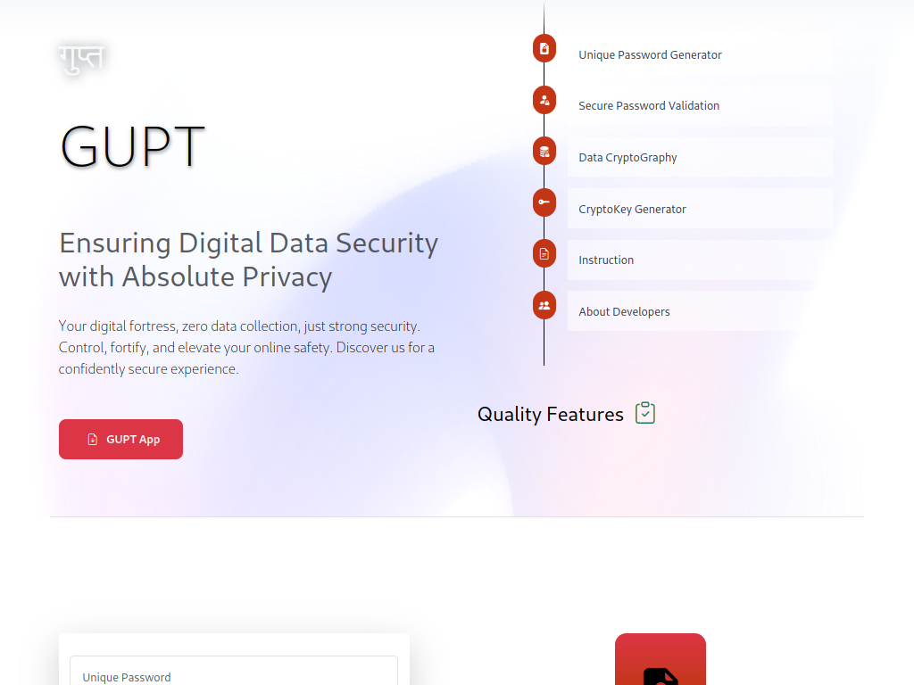

# Project-2

- Name : "Gupt"

- Description : "Ensuring Digital Data Secruity with Absolute Privacy"

- Version : main

- Update : 17-03-2024

- Status : REST

- Responsive : True

- TechStack : { HTML | CSS | JavaScript }

- Thanks : { GitHub | VSCodium | GIMP | Bootstrap }

- Collabrate : { MayankDevil | Hritikkumar975 }

- URL : https://mayankdevil.github.io/Project-2/

#### Project Look & Feel

#### Responsive

_Experience seamless interaction across all devices with our web application's fully responsive user interface, adapting effortlessly to every screen size and ensuring a captivating experience for every user._

  **SCREEN** { 1200PX | 992PX | 785PX | 556PX }

#### Theme

_Immerse yourself in the elegance of simplicity with our Light Theme's deliberate color palette, featuring a harmonious blend of red, white, and subtle accents of black or lighter tones, crafting a sleek and minimalist design._

#### Features

 - [x] Simple UI/UX
 
 - [x] Responsive Design
 
 - [x] Free Service
 
 - [x] No Data Collection
 
 - [x] Focus on Data Security

### Copyright Notice

Copyright (c) 2024 by _Mayank_ & _HRitik_. All Rights Reserved.                *

__This GUPT Project is the property of Mayank & HRitik and is protected under copyright law. Unauthorized reproduction, distribution, or disclosure of this Project , or any part of its contents, is strictly prohibited.__

For permissions, please contact the repository owners through their GitHub profiles:

https://github.com/MayankDevil/

https://github.com/Hritikkumar975/

Any unauthorized use of the material within this repository may constitute a violation of copyright law. Use only services.

